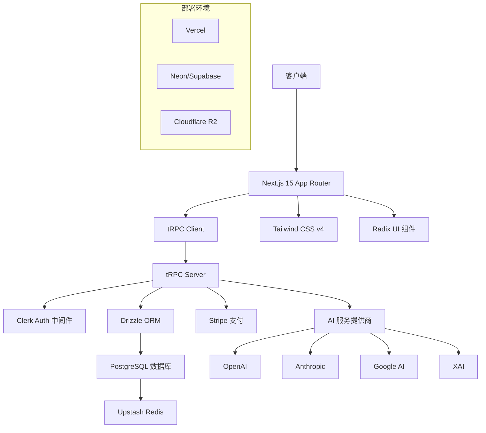
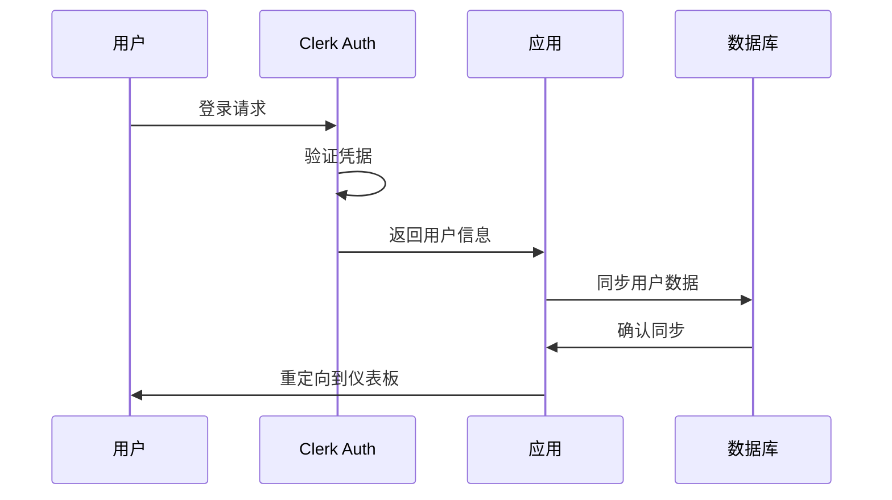
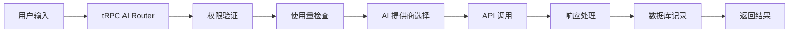

AI SaaS Template 采用现代化的技术架构设计，基于 Next.js 15 App Router、tRPC、Clerk Auth 和 Drizzle ORM 等前沿技术栈构建，确保应用的可扩展性、类型安全性和开发效率。

## 架构概览

### 技术栈架构



### 核心架构原则

- **类型安全**: 端到端的 TypeScript 类型安全，从数据库到前端
- **服务器优先**: 利用 Next.js 15 App Router 的服务器组件优势
- **API 优先**: 基于 tRPC 的类型安全 API 开发
- **模块化设计**: 清晰的功能模块分离和组件化架构
- **现代化工具**: 使用最新的开发工具提升开发体验

## 前端架构

### Next.js 15 App Router

```
src/app/
├── [locale]/                   # 国际化路由层
│   ├── (dashboard)/           # 仪表板路由组
│   ├── (front)/              # 前台页面路由组
│   ├── auth/                 # 认证页面
│   └── docs/                 # 文档页面
├── api/                      # API 路由
│   ├── trpc/                 # tRPC 端点
│   └── webhooks/             # Webhook 处理
└── globals.css               # 全局样式
```

### 组件架构

```typescript
// 组件层次结构
src/components/
├── ui/                      # 基础 UI 组件 (shadcn/ui)
├── layout/                  # 布局组件
├── dashboard/               # 仪表板组件
├── auth/                    # 认证组件
├── payment/                 # 支付组件
├── ai/                      # AI 功能组件
├── providers/               # Context 提供者
└── common/                  # 通用组件
```

### 状态管理

```typescript
// 使用 TanStack Query + tRPC 进行状态管理
const { data: user } = api.user.getProfile.useQuery()
const { mutate: updateProfile } = api.user.updateProfile.useMutation()

// 客户端状态使用 React 内置 state 和 context
const [theme, setTheme] = useTheme()
```

## 后端架构

### tRPC API 层

```typescript
// src/lib/trpc/routers/index.ts
export const appRouter = createTRPCRouter({
  auth: authRouter,        // 认证相关
  user: userRouter,        // 用户管理
  payment: paymentRouter,  // 支付功能
  ai: aiRouter,           // AI 功能
  admin: adminRouter,     // 管理后台
})

export type AppRouter = typeof appRouter
```

### API 路由结构

```
src/lib/trpc/routers/
├── auth.ts              # 认证路由
├── user.ts              # 用户路由
├── payment.ts           # 支付路由
├── ai.ts                # AI 路由
├── admin.ts             # 管理路由
└── index.ts             # 根路由器
```

### 中间件和权限

```typescript
// tRPC 中间件
export const protectedProcedure = publicProcedure.use(
  async ({ ctx, next }) => {
    if (!ctx.auth?.userId) {
      throw new TRPCError({ code: 'UNAUTHORIZED' })
    }
    
    const user = await getUserByClerkId(ctx.auth.userId)
    if (!user) {
      throw new TRPCError({ code: 'NOT_FOUND' })
    }
    
    return next({
      ctx: {
        ...ctx,
        user,
      },
    })
  }
)
```

## 数据层架构

### Drizzle ORM 数据模型

```typescript
// 核心数据表结构
export const users = pgTable('users', {
  id: text('id').primaryKey().$defaultFn(() => createId()),
  clerkId: text('clerk_id').notNull().unique(),
  email: text('email').notNull().unique(),
  name: text('name'),
  planType: text('plan_type', { enum: ['free', 'basic', 'pro'] }).default('free'),
  aiUsageCount: integer('ai_usage_count').default(0),
  createdAt: timestamp('created_at').defaultNow(),
})

export const conversations = pgTable('conversations', {
  id: text('id').primaryKey().$defaultFn(() => createId()),
  userId: text('user_id').references(() => users.id, { onDelete: 'cascade' }),
  title: text('title').notNull(),
  model: text('model').notNull(),
  provider: text('provider').notNull(),
  createdAt: timestamp('created_at').defaultNow(),
})
```

### 数据库关系

```typescript
// 表关系定义
export const usersRelations = relations(users, ({ many }) => ({
  conversations: many(conversations),
  payments: many(payments),
  uploads: many(uploads),
}))

export const conversationsRelations = relations(conversations, ({ one, many }) => ({
  user: one(users, {
    fields: [conversations.userId],
    references: [users.id],
  }),
  messages: many(messages),
}))
```

## 认证架构

### Clerk Auth 集成

```typescript
// Clerk 配置
import { ClerkProvider } from '@clerk/nextjs'

export default function RootLayout({ children }: { children: React.ReactNode }) {
  return (
    <ClerkProvider
      publishableKey={env.NEXT_PUBLIC_CLERK_PUBLISHABLE_KEY}
      appearance={{
        elements: {
          formButtonPrimary: 'bg-primary hover:bg-primary/90',
        },
      }}
    >
      {children}
    </ClerkProvider>
  )
}
```

### 认证流程



### 权限控制

```typescript
// 基于角色的访问控制
export function requireRole(role: 'admin' | 'user') {
  return protectedProcedure.use(async ({ ctx, next }) => {
    if (ctx.user.role !== role && ctx.user.role !== 'admin') {
      throw new TRPCError({ code: 'FORBIDDEN' })
    }
    return next({ ctx })
  })
}

// 使用示例
export const adminProcedure = requireRole('admin')
```

## AI 服务架构

### 多提供商集成

```typescript
// AI 服务抽象层
interface AIProvider {
  name: string
  models: string[]
  generateResponse(params: AIParams): Promise<AIResponse>
}

class OpenAIProvider implements AIProvider {
  name = 'openai'
  models = ['gpt-4', 'gpt-3.5-turbo']
  
  async generateResponse(params: AIParams): Promise<AIResponse> {
    // OpenAI 实现
  }
}

class AnthropicProvider implements AIProvider {
  name = 'anthropic'
  models = ['claude-3-sonnet', 'claude-3-haiku']
  
  async generateResponse(params: AIParams): Promise<AIResponse> {
    // Anthropic 实现
  }
}
```

### AI 请求处理流程



## 支付系统架构

### Stripe 集成

```typescript
// Stripe 配置
import Stripe from 'stripe'

export const stripe = new Stripe(env.STRIPE_SECRET_KEY, {
  apiVersion: '2023-10-16',
})

// 订阅创建
export async function createSubscription(userId: string, priceId: string) {
  const user = await getUserById(userId)
  
  const subscription = await stripe.subscriptions.create({
    customer: user.stripeCustomerId,
    items: [{ price: priceId }],
    payment_behavior: 'default_incomplete',
    expand: ['latest_invoice.payment_intent'],
  })
  
  return subscription
}
```

### Webhook 处理

```typescript
// Webhook 事件处理
export async function handleStripeWebhook(event: Stripe.Event) {
  switch (event.type) {
    case 'customer.subscription.created':
      await handleSubscriptionCreated(event.data.object)
      break
    case 'customer.subscription.updated':
      await handleSubscriptionUpdated(event.data.object)
      break
    case 'invoice.payment_succeeded':
      await handlePaymentSucceeded(event.data.object)
      break
  }
}
```

## 文件存储架构

### 多存储提供商支持

```typescript
// 存储抽象层
interface StorageProvider {
  upload(file: File, key: string): Promise<string>
  delete(key: string): Promise<void>
  getUrl(key: string): string
}

class CloudflareR2Provider implements StorageProvider {
  async upload(file: File, key: string): Promise<string> {
    // Cloudflare R2 实现
  }
}

class AWSS3Provider implements StorageProvider {
  async upload(file: File, key: string): Promise<string> {
    // AWS S3 实现
  }
}
```

## 国际化架构

### next-intl 集成

```typescript
// i18n 配置
import { notFound } from 'next/navigation'
import { getRequestConfig } from 'next-intl/server'

export default getRequestConfig(async ({ locale }) => {
  if (!['en', 'zh'].includes(locale)) {
    notFound()
  }
  
  return {
    messages: (await import(`../messages/${locale}.json`)).default,
  }
})
```

### 路由本地化

```
app/
├── [locale]/
│   ├── page.tsx           # /{locale}
│   ├── dashboard/
│   │   └── page.tsx      # /{locale}/dashboard
│   └── auth/
│       └── sign-in/
│           └── page.tsx  # /{locale}/auth/sign-in
```

## 缓存架构

### 多层缓存策略

```typescript
// Redis 缓存
import { Redis } from '@upstash/redis'

export const redis = new Redis({
  url: env.UPSTASH_REDIS_REST_URL,
  token: env.UPSTASH_REDIS_REST_TOKEN,
})

// 缓存装饰器
export function cached<T>(key: string, ttl: number = 3600) {
  return function (target: any, propertyName: string, descriptor: PropertyDescriptor) {
    const method = descriptor.value
    
    descriptor.value = async function (...args: any[]) {
      const cacheKey = `${key}:${JSON.stringify(args)}`
      
      let result = await redis.get(cacheKey)
      if (result) return result
      
      result = await method.apply(this, args)
      await redis.setex(cacheKey, ttl, JSON.stringify(result))
      
      return result
    }
  }
}
```

## 测试架构

### 测试策略

```typescript
// 单元测试示例
describe('User API', () => {
  it('should create user', async () => {
    const caller = appRouter.createCaller({
      auth: { userId: 'test-user' },
      db,
    })
    
    const result = await caller.user.create({
      email: 'test@example.com',
      name: 'Test User',
    })
    
    expect(result.email).toBe('test@example.com')
  })
})

// E2E 测试示例
test('should complete signup flow', async ({ page }) => {
  await page.goto('/auth/sign-up')
  await page.fill('[name="email"]', 'test@example.com')
  await page.fill('[name="password"]', 'password123')
  await page.click('[type="submit"]')
  
  await expect(page).toHaveURL('/dashboard')
})
```

## 监控与日志

### 应用监控

```typescript
// 错误监控
import * as Sentry from '@sentry/nextjs'

export function initMonitoring() {
  Sentry.init({
    dsn: env.SENTRY_DSN,
    integrations: [
      new Sentry.BrowserTracing(),
    ],
    tracesSampleRate: 1.0,
  })
}

// 性能监控
export function trackPerformance(operation: string, duration: number) {
  console.log(`${operation} took ${duration}ms`)
  
  // 发送到监控服务
  if (env.NODE_ENV === 'production') {
    // 发送性能数据
  }
}
```

## 部署架构

### Vercel 部署

```typescript
// vercel.json
{
  "functions": {
    "app/api/**/*": {
      "maxDuration": 30
    }
  },
  "regions": ["cle1"],
  "env": {
    "DATABASE_URL": "@database_url",
    "CLERK_SECRET_KEY": "@clerk_secret_key"
  }
}
```

### CI/CD 流程

```yaml
# .github/workflows/deploy.yml
name: Deploy to Vercel
on:
  push:
    branches: [main]

jobs:
  deploy:
    runs-on: ubuntu-latest
    steps:
      - uses: actions/checkout@v3
      - uses: actions/setup-node@v3
        with:
          node-version: '20'
      
      - name: Install dependencies
        run: pnpm install
      
      - name: Run tests
        run: pnpm test
      
      - name: Run type check
        run: pnpm type-check
      
      - name: Deploy to Vercel
        run: vercel --prod --token=${{ secrets.VERCEL_TOKEN }}
```

## 安全架构

### 多层安全防护

```typescript
// 输入验证
export const createUserSchema = z.object({
  email: z.string().email(),
  name: z.string().min(1).max(100),
})

// 权限验证
export function requireAuth() {
  return protectedProcedure.use(async ({ ctx, next }) => {
    if (!ctx.auth) {
      throw new TRPCError({ code: 'UNAUTHORIZED' })
    }
    return next({ ctx })
  })
}

// 限流
export function rateLimit(requests: number, window: string) {
  return middleware(async ({ ctx, next }) => {
    const key = `rate_limit:${ctx.auth?.userId}:${Date.now()}`
    const current = await redis.incr(key)
    
    if (current > requests) {
      throw new TRPCError({ code: 'TOO_MANY_REQUESTS' })
    }
    
    await redis.expire(key, parseTime(window))
    return next({ ctx })
  })
}
```

## 扩展性设计

### 微服务就绪

项目架构设计时考虑了未来的微服务拆分可能性：

- 认证服务：基于 Clerk Auth 的独立认证
- 支付服务：Stripe 集成的支付处理
- AI 服务：多提供商的 AI 功能
- 文件服务：云存储的文件管理
- 通知服务：邮件和推送通知

### 性能优化

- **服务器组件**：利用 Next.js 15 的服务器组件减少客户端包大小
- **代码分割**：基于路由和功能的动态导入
- **图片优化**：Next.js Image 组件的自动优化
- **数据库优化**：索引优化和查询优化
- **缓存策略**：多层缓存提升响应速度

这个现代化的架构为构建可扩展、安全、高性能的 AI SaaS 应用提供了坚实的基础，结合了最新的技术栈和最佳实践。