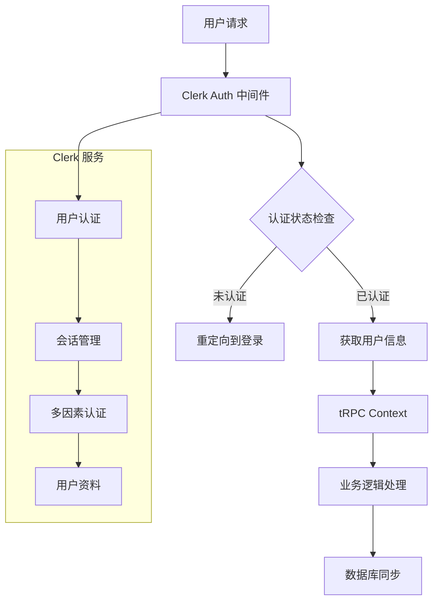

AI SaaS Template 采用 Clerk Auth 构建现代化的认证系统，提供企业级的身份认证和用户管理功能。支持多种认证方式、完善的用户管理、基于角色的访问控制和安全的会话管理。

## 系统概述

### 核心特性

- **🔐 现代认证**: 基于 Clerk Auth 的企业级认证服务
- **🌐 多种登录方式**: 邮箱密码、社交登录 (GitHub、Google)
- **👥 用户管理**: 完整的用户生命周期管理
- **🛡️ 安全保护**: 内置安全最佳实践和威胁防护
- **🎯 无缝集成**: 与 tRPC 和数据库的深度集成
- **📱 跨平台支持**: Web 和移动应用统一认证

### 技术架构



## Clerk Auth 配置

### 环境变量设置

```bash
# Clerk 认证配置
NEXT_PUBLIC_CLERK_PUBLISHABLE_KEY="pk_test_..."
CLERK_SECRET_KEY="sk_test_..."
NEXT_PUBLIC_CLERK_SIGN_IN_URL="/auth/sign-in"
NEXT_PUBLIC_CLERK_SIGN_UP_URL="/auth/sign-up"
NEXT_PUBLIC_CLERK_AFTER_SIGN_IN_URL="/dashboard"
NEXT_PUBLIC_CLERK_AFTER_SIGN_UP_URL="/dashboard"

# 可选：自定义域名
NEXT_PUBLIC_CLERK_JS_URL="https://your-subdomain.clerk.accounts.dev"
```

### 根布局配置

```typescript
// src/app/layout.tsx
import { ClerkProvider } from '@clerk/nextjs'
import { env } from '@/env'

export default function RootLayout({
  children,
}: {
  children: React.ReactNode
}) {
  return (
    <html lang="en">
      <body>
        <ClerkProvider
          publishableKey={env.NEXT_PUBLIC_CLERK_PUBLISHABLE_KEY}
          appearance={{
            elements: {
              formButtonPrimary: 'bg-primary text-primary-foreground hover:bg-primary/90',
              card: 'bg-card border-border',
              headerTitle: 'text-foreground',
              headerSubtitle: 'text-muted-foreground',
              socialButtonsBlockButton: 'bg-secondary text-secondary-foreground border-border',
              formFieldInput: 'bg-background border-border',
            },
            variables: {
              colorPrimary: 'hsl(var(--primary))',
              colorBackground: 'hsl(var(--background))',
              colorInputBackground: 'hsl(var(--background))',
              colorInputText: 'hsl(var(--foreground))',
            },
          }}
        >
          {children}
        </ClerkProvider>
      </body>
    </html>
  )
}
```

### 中间件配置

```typescript
// middleware.ts
import { clerkMiddleware, createRouteMatcher } from '@clerk/nextjs/server'

const isProtectedRoute = createRouteMatcher([
  '/dashboard(.*)',
  '/admin(.*)',
  '/api/trpc(.*)',
])

export default clerkMiddleware((auth, req) => {
  if (isProtectedRoute(req)) {
    auth().protect()
  }
})

export const config = {
  matcher: [
    '/((?!_next|[^?]*\\.(?:html?|css|js(?!on)|jpe?g|webp|png|gif|svg|ttf|woff2?|ico|csv|docx?|xlsx?|zip|webmanifest)).*)',
    '/(api|trpc)(.*)',
  ],
}
```

## 数据库集成

### 用户数据同步

```typescript
// src/lib/db/schema.ts
export const users = pgTable('users', {
  id: text('id').primaryKey().$defaultFn(() => createId()),
  clerkId: text('clerk_id').notNull().unique(), // Clerk 用户 ID
  email: text('email').notNull().unique(),
  name: text('name'),
  imageUrl: text('image_url'),
  role: text('role', { enum: ['user', 'admin'] }).notNull().default('user'),
  
  // 订阅信息
  subscriptionId: text('subscription_id'),
  subscriptionStatus: text('subscription_status'),
  planType: text('plan_type', { enum: ['free', 'basic', 'pro'] }).notNull().default('free'),
  
  // AI 使用统计
  aiUsageCount: integer('ai_usage_count').notNull().default(0),
  aiUsageLimit: integer('ai_usage_limit').notNull().default(10),
  
  createdAt: timestamp('created_at').notNull().defaultNow(),
  updatedAt: timestamp('updated_at').notNull().defaultNow().$onUpdateFn(() => new Date()),
})
```

### Webhook 事件处理

```typescript
// src/app/api/webhooks/clerk/route.ts
import { Webhook } from 'svix'
import { headers } from 'next/headers'
import { WebhookEvent } from '@clerk/nextjs/server'
import { createUser, updateUser, deleteUser } from '@/lib/db/queries/users'

export async function POST(req: Request) {
  const WEBHOOK_SECRET = process.env.CLERK_WEBHOOK_SECRET
  
  if (!WEBHOOK_SECRET) {
    throw new Error('Please add CLERK_WEBHOOK_SECRET from Clerk Dashboard to .env or .env.local')
  }

  const headerPayload = headers()
  const svix_id = headerPayload.get("svix-id")
  const svix_timestamp = headerPayload.get("svix-timestamp")
  const svix_signature = headerPayload.get("svix-signature")

  if (!svix_id || !svix_timestamp || !svix_signature) {
    return new Response('Error occured -- no svix headers', {
      status: 400
    })
  }

  const payload = await req.json()
  const body = JSON.stringify(payload)

  const wh = new Webhook(WEBHOOK_SECRET)

  let evt: WebhookEvent

  try {
    evt = wh.verify(body, {
      "svix-id": svix_id,
      "svix-timestamp": svix_timestamp,
      "svix-signature": svix_signature,
    }) as WebhookEvent
  } catch (err) {
    console.error('Error verifying webhook:', err)
    return new Response('Error occured', {
      status: 400
    })
  }

  const { id } = evt.data
  const eventType = evt.type

  if (eventType === 'user.created') {
    await createUser({
      clerkId: id!,
      email: evt.data.email_addresses[0]?.email_address!,
      name: `${evt.data.first_name} ${evt.data.last_name}`.trim(),
      imageUrl: evt.data.image_url,
    })
  }

  if (eventType === 'user.updated') {
    await updateUser(id!, {
      email: evt.data.email_addresses[0]?.email_address!,
      name: `${evt.data.first_name} ${evt.data.last_name}`.trim(),
      imageUrl: evt.data.image_url,
    })
  }

  if (eventType === 'user.deleted') {
    await deleteUser(id!)
  }

  return new Response('', { status: 200 })
}
```

## tRPC 集成

### 认证上下文

```typescript
// src/lib/trpc/context.ts
import { auth } from '@clerk/nextjs/server'
import { getUserByClerkId } from '@/lib/db/queries/users'

export async function createTRPCContext() {
  const { userId } = auth()
  
  let user = null
  if (userId) {
    user = await getUserByClerkId(userId)
  }

  return {
    auth: { userId },
    user,
    db,
  }
}
```

### 受保护的过程

```typescript
// src/lib/trpc/server.ts
import { TRPCError } from '@trpc/server'

export const protectedProcedure = publicProcedure.use(
  async ({ ctx, next }) => {
    if (!ctx.auth?.userId) {
      throw new TRPCError({ code: 'UNAUTHORIZED' })
    }
    
    if (!ctx.user) {
      throw new TRPCError({ 
        code: 'NOT_FOUND', 
        message: 'User not found in database' 
      })
    }
    
    return next({
      ctx: {
        ...ctx,
        auth: ctx.auth,
        user: ctx.user,
      },
    })
  }
)

// 管理员权限过程
export const adminProcedure = protectedProcedure.use(
  async ({ ctx, next }) => {
    if (ctx.user.role !== 'admin') {
      throw new TRPCError({ code: 'FORBIDDEN' })
    }
    
    return next({ ctx })
  }
)
```

## 认证页面

### 登录页面

```typescript
// src/app/[locale]/auth/sign-in/page.tsx
import { SignIn } from '@clerk/nextjs'

export default function SignInPage() {
  return (
    <div className="flex min-h-screen items-center justify-center">
      <SignIn 
        appearance={{
          elements: {
            formButtonPrimary: 'bg-primary hover:bg-primary/90',
            card: 'shadow-lg',
            headerTitle: 'text-2xl font-bold',
            headerSubtitle: 'text-muted-foreground',
          },
        }}
        redirectUrl="/dashboard"
      />
    </div>
  )
}
```

### 注册页面

```typescript
// src/app/[locale]/auth/sign-up/page.tsx
import { SignUp } from '@clerk/nextjs'

export default function SignUpPage() {
  return (
    <div className="flex min-h-screen items-center justify-center">
      <SignUp 
        appearance={{
          elements: {
            formButtonPrimary: 'bg-primary hover:bg-primary/90',
            card: 'shadow-lg',
            headerTitle: 'text-2xl font-bold',
            headerSubtitle: 'text-muted-foreground',
          },
        }}
        redirectUrl="/dashboard"
      />
    </div>
  )
}
```

### 用户资料页面

```typescript
// src/app/[locale]/dashboard/settings/profile/page.tsx
import { UserProfile } from '@clerk/nextjs'

export default function ProfilePage() {
  return (
    <div className="container mx-auto py-8">
      <h1 className="text-3xl font-bold mb-8">用户资料</h1>
      <UserProfile 
        appearance={{
          elements: {
            card: 'border rounded-lg shadow-sm',
            navbar: 'border-b',
            navbarButton: 'text-foreground hover:bg-accent',
            formButtonPrimary: 'bg-primary hover:bg-primary/90',
          },
        }}
      />
    </div>
  )
}
```

## 用户管理组件

### 用户按钮组件

```tsx
// src/components/auth/user-button.tsx
'use client'

import { UserButton as ClerkUserButton } from '@clerk/nextjs'
import { useUser } from '@clerk/nextjs'

export function UserButton() {
  const { user } = useUser()
  
  return (
    <ClerkUserButton
      appearance={{
        elements: {
          avatarBox: 'w-8 h-8',
          userButtonPopoverCard: 'bg-popover border-border shadow-lg',
          userButtonPopoverActionButton: 'text-popover-foreground hover:bg-accent',
        },
      }}
      afterSignOutUrl="/"
      showName={false}
    />
  )
}
```

### 认证状态组件

```tsx
// src/components/auth/auth-status.tsx
'use client'

import { useAuth, useUser } from '@clerk/nextjs'
import { Button } from '@/components/ui/button'
import { Card, CardContent, CardDescription, CardHeader, CardTitle } from '@/components/ui/card'

export function AuthStatus() {
  const { isLoaded, isSignedIn } = useAuth()
  const { user } = useUser()

  if (!isLoaded) {
    return <div>Loading...</div>
  }

  if (!isSignedIn) {
    return (
      <Card>
        <CardHeader>
          <CardTitle>未登录</CardTitle>
          <CardDescription>请登录以访问您的账户</CardDescription>
        </CardHeader>
        <CardContent>
          <Button asChild>
            <a href="/auth/sign-in">登录</a>
          </Button>
        </CardContent>
      </Card>
    )
  }

  return (
    <Card>
      <CardHeader>
        <CardTitle>欢迎回来！</CardTitle>
        <CardDescription>您已成功登录</CardDescription>
      </CardHeader>
      <CardContent className="space-y-2">
        <p><strong>姓名:</strong> {user?.fullName}</p>
        <p><strong>邮箱:</strong> {user?.primaryEmailAddress?.emailAddress}</p>
        <p><strong>用户ID:</strong> {user?.id}</p>
        <p><strong>创建时间:</strong> {user?.createdAt?.toLocaleDateString()}</p>
      </CardContent>
    </Card>
  )
}
```

## 路由保护

### 认证检查组件

```tsx
// src/components/auth/auth-guard.tsx
'use client'

import { useAuth } from '@clerk/nextjs'
import { useRouter } from 'next/navigation'
import { useEffect } from 'react'
import { LoadingSpinner } from '@/components/ui/loading-spinner'

interface AuthGuardProps {
  children: React.ReactNode
  fallbackUrl?: string
}

export function AuthGuard({ children, fallbackUrl = '/auth/sign-in' }: AuthGuardProps) {
  const { isLoaded, isSignedIn } = useAuth()
  const router = useRouter()

  useEffect(() => {
    if (isLoaded && !isSignedIn) {
      router.push(fallbackUrl)
    }
  }, [isLoaded, isSignedIn, router, fallbackUrl])

  if (!isLoaded) {
    return (
      <div className="flex items-center justify-center min-h-screen">
        <LoadingSpinner />
      </div>
    )
  }

  if (!isSignedIn) {
    return null
  }

  return <>{children}</>
}
```

### 基于角色的组件

```tsx
// src/components/auth/role-guard.tsx
'use client'

import { useUser } from '@clerk/nextjs'
import { api } from '@/lib/trpc/client'

interface RoleGuardProps {
  children: React.ReactNode
  allowedRoles: string[]
  fallback?: React.ReactNode
}

export function RoleGuard({ 
  children, 
  allowedRoles, 
  fallback = <div>您没有权限访问此内容</div> 
}: RoleGuardProps) {
  const { user } = useUser()
  const { data: dbUser } = api.user.getProfile.useQuery(undefined, {
    enabled: !!user,
  })

  if (!user || !dbUser) {
    return <div>Loading...</div>
  }

  if (!allowedRoles.includes(dbUser.role)) {
    return fallback
  }

  return <>{children}</>
}
```

## 社交登录配置

### GitHub OAuth 设置

1. **创建 GitHub OAuth 应用**
   - 访问 [GitHub Developer Settings](https://github.com/settings/developers)
   - 点击 "New OAuth App"
   - 设置回调 URL: `https://your-domain.com/sso-callback`

2. **Clerk 配置**
   - 在 Clerk 控制台中启用 GitHub 提供商
   - 输入 GitHub Client ID 和 Client Secret
   - 配置权限范围 (email, profile)

### Google OAuth 设置

1. **Google Cloud Console 配置**
   - 访问 [Google Cloud Console](https://console.cloud.google.com)
   - 创建 OAuth 2.0 凭据
   - 添加授权重定向 URI: `https://your-domain.com/sso-callback`

2. **Clerk 配置**
   - 在 Clerk 控制台中启用 Google 提供商
   - 输入 Google Client ID 和 Client Secret
   - 配置权限范围 (email, profile)

## 自定义认证组件

### 自定义登录表单

```tsx
// src/components/auth/custom-sign-in.tsx
'use client'

import { useState } from 'react'
import { useSignIn } from '@clerk/nextjs'
import { useRouter } from 'next/navigation'
import { Button } from '@/components/ui/button'
import { Input } from '@/components/ui/input'
import { Label } from '@/components/ui/label'
import { Card, CardContent, CardDescription, CardHeader, CardTitle } from '@/components/ui/card'
import { toast } from '@/components/ui/use-toast'

export function CustomSignIn() {
  const { isLoaded, signIn, setActive } = useSignIn()
  const [email, setEmail] = useState('')
  const [password, setPassword] = useState('')
  const [isLoading, setIsLoading] = useState(false)
  const router = useRouter()

  if (!isLoaded) {
    return <div>Loading...</div>
  }

  const handleSubmit = async (e: React.FormEvent) => {
    e.preventDefault()
    setIsLoading(true)

    try {
      const result = await signIn.create({
        identifier: email,
        password,
      })

      if (result.status === 'complete') {
        await setActive({ session: result.createdSessionId })
        router.push('/dashboard')
      } else {
        console.log(result)
      }
    } catch (err: any) {
      toast({
        title: '登录失败',
        description: err.errors[0]?.message || '请检查您的邮箱和密码',
        variant: 'destructive',
      })
    } finally {
      setIsLoading(false)
    }
  }

  return (
    <Card className="w-full max-w-md">
      <CardHeader>
        <CardTitle>登录</CardTitle>
        <CardDescription>输入您的邮箱和密码以登录</CardDescription>
      </CardHeader>
      <CardContent>
        <form onSubmit={handleSubmit} className="space-y-4">
          <div className="space-y-2">
            <Label htmlFor="email">邮箱</Label>
            <Input
              id="email"
              type="email"
              value={email}
              onChange={(e) => setEmail(e.target.value)}
              required
            />
          </div>
          <div className="space-y-2">
            <Label htmlFor="password">密码</Label>
            <Input
              id="password"
              type="password"
              value={password}
              onChange={(e) => setPassword(e.target.value)}
              required
            />
          </div>
          <Button type="submit" className="w-full" disabled={isLoading}>
            {isLoading ? '登录中...' : '登录'}
          </Button>
        </form>
      </CardContent>
    </Card>
  )
}
```

## 用户数据查询

### 用户查询钩子

```typescript
// src/hooks/use-current-user.ts
import { useUser } from '@clerk/nextjs'
import { api } from '@/lib/trpc/client'

export function useCurrentUser() {
  const { user: clerkUser, isLoaded } = useUser()
  
  const { data: dbUser, isLoading: isDbUserLoading } = api.user.getProfile.useQuery(
    undefined,
    {
      enabled: !!clerkUser && isLoaded,
    }
  )

  return {
    clerkUser,
    dbUser,
    isLoading: !isLoaded || isDbUserLoading,
    isSignedIn: !!clerkUser,
  }
}
```

### 用户统计信息

```typescript
// src/lib/trpc/routers/user.ts
export const userRouter = createTRPCRouter({
  getProfile: protectedProcedure.query(async ({ ctx }) => {
    return ctx.user
  }),

  getStats: protectedProcedure.query(async ({ ctx }) => {
    const stats = await getUserStats(ctx.user.id)
    return stats
  }),

  updateProfile: protectedProcedure
    .input(z.object({
      name: z.string().optional(),
      email: z.string().email().optional(),
    }))
    .mutation(async ({ ctx, input }) => {
      return await updateUser(ctx.user.clerkId, input)
    }),
})
```

## 安全最佳实践

### 环境变量保护

```typescript
// env.ts 中的验证
server: {
  CLERK_SECRET_KEY: z.string().min(1),
  CLERK_WEBHOOK_SECRET: z.string().min(1),
},
client: {
  NEXT_PUBLIC_CLERK_PUBLISHABLE_KEY: z.string().min(1),
  NEXT_PUBLIC_CLERK_SIGN_IN_URL: z.string().default('/auth/sign-in'),
  NEXT_PUBLIC_CLERK_SIGN_UP_URL: z.string().default('/auth/sign-up'),
}
```

### 会话安全

```typescript
// src/lib/trpc/context.ts
export async function createTRPCContext() {
  const { userId, sessionClaims } = auth()
  
  // 验证会话有效性
  if (userId && sessionClaims) {
    const user = await getUserByClerkId(userId)
    
    // 检查用户状态
    if (user && !user.isActive) {
      throw new TRPCError({ 
        code: 'FORBIDDEN', 
        message: 'Account is deactivated' 
      })
    }
    
    return { auth: { userId }, user, db }
  }
  
  return { auth: null, user: null, db }
}
```

## 测试认证功能

### 认证组件测试

```typescript
// __tests__/auth/auth-guard.test.tsx
import { render, screen } from '@testing-library/react'
import { useAuth } from '@clerk/nextjs'
import { AuthGuard } from '@/components/auth/auth-guard'

// Mock Clerk
jest.mock('@clerk/nextjs')
const mockUseAuth = useAuth as jest.MockedFunction<typeof useAuth>

describe('AuthGuard', () => {
  it('should render children when user is authenticated', () => {
    mockUseAuth.mockReturnValue({
      isLoaded: true,
      isSignedIn: true,
      userId: 'user_123',
    } as any)

    render(
      <AuthGuard>
        <div>Protected content</div>
      </AuthGuard>
    )

    expect(screen.getByText('Protected content')).toBeInTheDocument()
  })

  it('should redirect when user is not authenticated', () => {
    mockUseAuth.mockReturnValue({
      isLoaded: true,
      isSignedIn: false,
      userId: null,
    } as any)

    render(
      <AuthGuard>
        <div>Protected content</div>
      </AuthGuard>
    )

    expect(screen.queryByText('Protected content')).not.toBeInTheDocument()
  })
})
```

### API 路由测试

```typescript
// __tests__/api/user.test.ts
import { createTRPCMsw } from 'msw-trpc'
import { appRouter } from '@/lib/trpc/routers'

const trpcMsw = createTRPCMsw(appRouter)

describe('User API', () => {
  it('should return user profile', async () => {
    const caller = appRouter.createCaller({
      auth: { userId: 'user_123' },
      user: {
        id: '1',
        clerkId: 'user_123',
        email: 'test@example.com',
        name: 'Test User',
        role: 'user',
      },
      db,
    })

    const result = await caller.user.getProfile()
    expect(result.email).toBe('test@example.com')
  })
})
```

## 常见问题解决

### 1. Webhook 配置问题

确保在 Clerk 控制台中正确配置 Webhook：
- URL: `https://your-domain.com/api/webhooks/clerk`
- 事件: `user.created`, `user.updated`, `user.deleted`
- 签名密钥设置为环境变量 `CLERK_WEBHOOK_SECRET`

### 2. 本地开发设置

```bash
# 安装 ngrok 用于本地 webhook 测试
npm install -g ngrok

# 启动本地隧道
ngrok http 3000

# 使用 ngrok 提供的 URL 配置 Clerk Webhook
```

### 3. 用户数据同步问题

确保 Webhook 正确处理用户事件，并在数据库中同步用户信息。如果遇到同步问题，可以添加错误处理和重试逻辑。

这个现代化的认证系统为 AI SaaS 应用提供了安全、可扩展的用户管理解决方案，结合了 Clerk Auth 的强大功能和项目的具体需求。