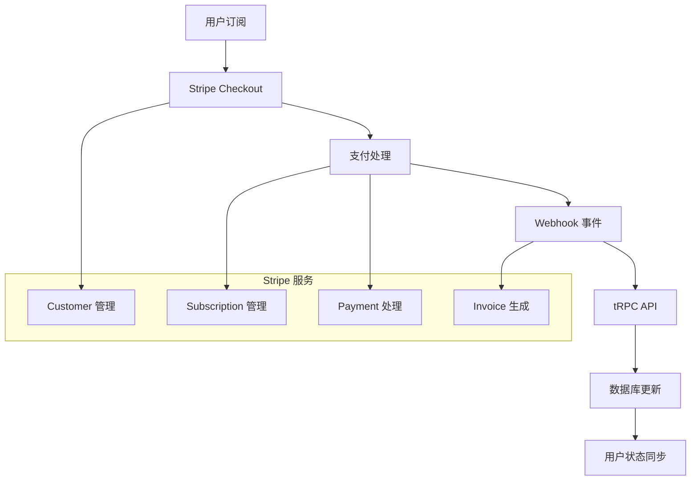

AI SaaS Template 集成了完整的 Stripe 支付系统，提供企业级的订阅管理、自动账单处理、Webhook 事件处理和用户友好的账单仪表板。支持多种付费计划、灵活的计费周期和完善的支付体验。

## 系统概述

### 核心特性

- **🔒 安全支付**: 基于 Stripe 的 PCI 合规支付处理
- **📊 订阅管理**: 灵活的订阅计划和自动续费
- **💳 多种支付方式**: 支持信用卡、借记卡和数字钱包
- **🔄 Webhook 集成**: 实时事件处理和状态同步
- **📈 使用量计费**: 基于 AI 使用量的计费模式
- **🧾 发票管理**: 自动生成和发送发票
- **⚡ 即时生效**: 订阅状态的实时更新

### 技术架构



## Stripe 配置

### 环境变量设置

```bash
# Stripe 配置
STRIPE_SECRET_KEY="sk_test_..."  # 生产环境使用 sk_live_
NEXT_PUBLIC_STRIPE_PUBLISHABLE_KEY="pk_test_..."  # 生产环境使用 pk_live_
STRIPE_WEBHOOK_SECRET="whsec_..."

# 可选：Stripe Connect (多商户支持)
STRIPE_CONNECT_CLIENT_ID="ca_..."
```

### Stripe 客户端初始化

```typescript
// src/lib/stripe/config.ts
import Stripe from 'stripe'
import { env } from '@/env'

export const stripe = new Stripe(env.STRIPE_SECRET_KEY, {
  apiVersion: '2023-10-16',
  typescript: true,
})

// 客户端 Stripe Promise
export const getStripe = () => {
  return loadStripe(env.NEXT_PUBLIC_STRIPE_PUBLISHABLE_KEY)
}
```

### 订阅计划配置

```typescript
// src/lib/payments/plans.ts
export const SUBSCRIPTION_PLANS = {
  free: {
    id: 'free',
    name: '免费版',
    description: '个人用户和小型项目',
    price: 0,
    interval: 'month' as const,
    features: [
      '10 次 AI 对话/月',
      '基础模型访问',
      '社区支持',
      '基础文档',
    ],
    limits: {
      aiUsage: 10,
      projects: 1,
      storage: 100 * 1024 * 1024, // 100MB
    },
    stripePriceId: null, // 免费计划无需 Stripe Price ID
  },
  basic: {
    id: 'basic',
    name: '基础版',
    description: '适合个人专业使用',
    price: 19.99,
    interval: 'month' as const,
    features: [
      '1000 次 AI 对话/月',
      '所有 AI 模型',
      '邮件支持',
      '使用统计',
      '导出功能',
    ],
    limits: {
      aiUsage: 1000,
      projects: 5,
      storage: 1 * 1024 * 1024 * 1024, // 1GB
    },
    stripePriceId: 'price_basic_monthly',
  },
  pro: {
    id: 'pro',
    name: '专业版',
    description: '团队和企业用户',
    price: 49.99,
    interval: 'month' as const,
    features: [
      '无限 AI 对话',
      '优先模型访问',
      '优先支持',
      '高级分析',
      '团队协作',
      'API 访问',
    ],
    limits: {
      aiUsage: -1, // 无限制
      projects: -1, // 无限制
      storage: 10 * 1024 * 1024 * 1024, // 10GB
    },
    stripePriceId: 'price_pro_monthly',
  },
} as const

export type PlanId = keyof typeof SUBSCRIPTION_PLANS
export type Plan = typeof SUBSCRIPTION_PLANS[PlanId]

// 年付计划 (20% 折扣)
export const YEARLY_PLANS = {
  basic_yearly: {
    ...SUBSCRIPTION_PLANS.basic,
    id: 'basic_yearly',
    price: 191.90, // 12 * 19.99 * 0.8
    interval: 'year' as const,
    stripePriceId: 'price_basic_yearly',
  },
  pro_yearly: {
    ...SUBSCRIPTION_PLANS.pro,
    id: 'pro_yearly',
    price: 479.90, // 12 * 49.99 * 0.8
    interval: 'year' as const,
    stripePriceId: 'price_pro_yearly',
  },
} as const
```

## 数据库集成

### 支付相关数据表

```typescript
// src/lib/db/schema.ts (支付相关表)
export const subscriptions = pgTable('subscriptions', {
  id: text('id').primaryKey().$defaultFn(() => createId()),
  userId: text('user_id').notNull().references(() => users.id, { onDelete: 'cascade' }),
  
  // Stripe 相关
  stripeSubscriptionId: text('stripe_subscription_id').unique(),
  stripeCustomerId: text('stripe_customer_id'),
  stripePriceId: text('stripe_price_id'),
  
  // 订阅信息
  planId: text('plan_id').notNull(),
  status: text('status').notNull(), // active, canceled, past_due, trialing
  currentPeriodStart: timestamp('current_period_start'),
  currentPeriodEnd: timestamp('current_period_end'),
  cancelAtPeriodEnd: boolean('cancel_at_period_end').default(false),
  
  // 试用期
  trialStart: timestamp('trial_start'),
  trialEnd: timestamp('trial_end'),
  
  createdAt: timestamp('created_at').notNull().defaultNow(),
  updatedAt: timestamp('updated_at').notNull().defaultNow().$onUpdateFn(() => new Date()),
}, (table) => ({
  userIdIdx: index('subscriptions_user_id_idx').on(table.userId),
  stripeSubscriptionIdIdx: index('subscriptions_stripe_subscription_id_idx').on(table.stripeSubscriptionId),
}))

export const invoices = pgTable('invoices', {
  id: text('id').primaryKey().$defaultFn(() => createId()),
  userId: text('user_id').notNull().references(() => users.id, { onDelete: 'cascade' }),
  subscriptionId: text('subscription_id').references(() => subscriptions.id, { onDelete: 'set null' }),
  
  // Stripe 发票信息
  stripeInvoiceId: text('stripe_invoice_id').unique().notNull(),
  stripePaymentIntentId: text('stripe_payment_intent_id'),
  
  // 发票详情
  amount: integer('amount').notNull(), // 金额(分)
  currency: text('currency').notNull().default('usd'),
  status: text('status').notNull(), // draft, open, paid, void, uncollectible
  
  // 发票链接
  hostedInvoiceUrl: text('hosted_invoice_url'),
  invoicePdf: text('invoice_pdf'),
  
  // 计费周期
  periodStart: timestamp('period_start'),
  periodEnd: timestamp('period_end'),
  
  createdAt: timestamp('created_at').notNull().defaultNow(),
  updatedAt: timestamp('updated_at').notNull().defaultNow().$onUpdateFn(() => new Date()),
}, (table) => ({
  userIdIdx: index('invoices_user_id_idx').on(table.userId),
  stripeInvoiceIdIdx: index('invoices_stripe_invoice_id_idx').on(table.stripeInvoiceId),
}))

export const paymentMethods = pgTable('payment_methods', {
  id: text('id').primaryKey().$defaultFn(() => createId()),
  userId: text('user_id').notNull().references(() => users.id, { onDelete: 'cascade' }),
  
  // Stripe 支付方式信息
  stripePaymentMethodId: text('stripe_payment_method_id').unique().notNull(),
  
  // 支付方式详情
  type: text('type').notNull(), // card, bank_account, etc.
  brand: text('brand'), // visa, mastercard, etc.
  last4: text('last4'),
  expiryMonth: integer('expiry_month'),
  expiryYear: integer('expiry_year'),
  
  // 状态
  isDefault: boolean('is_default').default(false),
  
  createdAt: timestamp('created_at').notNull().defaultNow(),
}, (table) => ({
  userIdIdx: index('payment_methods_user_id_idx').on(table.userId),
  stripePaymentMethodIdIdx: index('payment_methods_stripe_payment_method_id_idx').on(table.stripePaymentMethodId),
}))
```

## tRPC 支付路由

### 支付相关 API

```typescript
// src/lib/trpc/routers/payment.ts
import { z } from 'zod'
import { TRPCError } from '@trpc/server'
import { createTRPCRouter, protectedProcedure } from '../server'
import { stripe } from '@/lib/stripe/config'
import { SUBSCRIPTION_PLANS } from '@/lib/payments/plans'
import { 
  createSubscription as createDbSubscription,
  updateSubscription,
  getActiveSubscription,
  createInvoice as createDbInvoice,
} from '@/lib/db/queries/payments'

export const paymentRouter = createTRPCRouter({
  // 获取当前订阅
  getCurrentSubscription: protectedProcedure.query(async ({ ctx }) => {
    const subscription = await getActiveSubscription(ctx.user.id)
    return subscription
  }),

  // 创建 Checkout Session
  createCheckoutSession: protectedProcedure
    .input(z.object({
      planId: z.enum(['basic', 'pro', 'basic_yearly', 'pro_yearly']),
      successUrl: z.string().url().optional(),
      cancelUrl: z.string().url().optional(),
    }))
    .mutation(async ({ ctx, input }) => {
      const plan = SUBSCRIPTION_PLANS[input.planId as keyof typeof SUBSCRIPTION_PLANS]
      if (!plan || !plan.stripePriceId) {
        throw new TRPCError({ code: 'BAD_REQUEST', message: 'Invalid plan' })
      }

      // 创建或获取 Stripe 客户
      let customer = await stripe.customers.search({
        query: `email:'${ctx.user.email}'`,
      })

      if (customer.data.length === 0) {
        const newCustomer = await stripe.customers.create({
          email: ctx.user.email,
          name: ctx.user.name || undefined,
          metadata: {
            userId: ctx.user.id,
            clerkId: ctx.user.clerkId,
          },
        })
        customer.data = [newCustomer]
      }

      // 创建 Checkout Session
      const session = await stripe.checkout.sessions.create({
        customer: customer.data[0].id,
        mode: 'subscription',
        line_items: [
          {
            price: plan.stripePriceId,
            quantity: 1,
          },
        ],
        success_url: input.successUrl || `${process.env.NEXT_PUBLIC_APP_URL}/dashboard?success=true`,
        cancel_url: input.cancelUrl || `${process.env.NEXT_PUBLIC_APP_URL}/pricing`,
        metadata: {
          userId: ctx.user.id,
          planId: input.planId,
        },
      })

      return {
        sessionId: session.id,
        url: session.url,
      }
    }),

  // 创建客户门户会话
  createPortalSession: protectedProcedure
    .input(z.object({
      returnUrl: z.string().url().optional(),
    }))
    .mutation(async ({ ctx, input }) => {
      const subscription = await getActiveSubscription(ctx.user.id)
      if (!subscription?.stripeCustomerId) {
        throw new TRPCError({ code: 'NOT_FOUND', message: 'No active subscription found' })
      }

      const session = await stripe.billingPortal.sessions.create({
        customer: subscription.stripeCustomerId,
        return_url: input.returnUrl || `${process.env.NEXT_PUBLIC_APP_URL}/dashboard/billing`,
      })

      return {
        url: session.url,
      }
    }),

  // 取消订阅
  cancelSubscription: protectedProcedure
    .input(z.object({
      immediate: z.boolean().default(false),
    }))
    .mutation(async ({ ctx, input }) => {
      const subscription = await getActiveSubscription(ctx.user.id)
      if (!subscription?.stripeSubscriptionId) {
        throw new TRPCError({ code: 'NOT_FOUND', message: 'No active subscription found' })
      }

      if (input.immediate) {
        // 立即取消
        await stripe.subscriptions.cancel(subscription.stripeSubscriptionId)
      } else {
        // 在计费周期结束时取消
        await stripe.subscriptions.update(subscription.stripeSubscriptionId, {
          cancel_at_period_end: true,
        })
      }

      return { success: true }
    }),

  // 恢复订阅
  resumeSubscription: protectedProcedure.mutation(async ({ ctx }) => {
    const subscription = await getActiveSubscription(ctx.user.id)
    if (!subscription?.stripeSubscriptionId) {
      throw new TRPCError({ code: 'NOT_FOUND', message: 'No active subscription found' })
    }

    await stripe.subscriptions.update(subscription.stripeSubscriptionId, {
      cancel_at_period_end: false,
    })

    return { success: true }
  }),

  // 获取发票历史
  getInvoices: protectedProcedure
    .input(z.object({
      limit: z.number().min(1).max(100).default(20),
      page: z.number().min(1).default(1),
    }))
    .query(async ({ ctx, input }) => {
      const offset = (input.page - 1) * input.limit
      
      const invoices = await db
        .select()
        .from(invoicesTable)
        .where(eq(invoicesTable.userId, ctx.user.id))
        .orderBy(desc(invoicesTable.createdAt))
        .limit(input.limit)
        .offset(offset)

      const total = await db
        .select({ count: count() })
        .from(invoicesTable)
        .where(eq(invoicesTable.userId, ctx.user.id))

      return {
        invoices,
        total: total[0].count,
        page: input.page,
        limit: input.limit,
        totalPages: Math.ceil(total[0].count / input.limit),
      }
    }),

  // 获取支付方式
  getPaymentMethods: protectedProcedure.query(async ({ ctx }) => {
    const methods = await db
      .select()
      .from(paymentMethodsTable)
      .where(eq(paymentMethodsTable.userId, ctx.user.id))
      .orderBy(desc(paymentMethodsTable.isDefault), desc(paymentMethodsTable.createdAt))

    return methods
  }),
})
```

## Webhook 事件处理

### Webhook 端点

```typescript
// src/app/api/webhooks/stripe/route.ts
import { headers } from 'next/headers'
import { NextRequest, NextResponse } from 'next/server'
import { stripe } from '@/lib/stripe/config'
import { env } from '@/env'
import {
  handleSubscriptionCreated,
  handleSubscriptionUpdated,
  handleSubscriptionDeleted,
  handleInvoicePaymentSucceeded,
  handleInvoicePaymentFailed,
  handleCustomerUpdated,
} from '@/lib/payments/webhook-handlers'

export async function POST(req: NextRequest) {
  const body = await req.text()
  const signature = headers().get('stripe-signature')

  if (!signature) {
    return NextResponse.json(
      { error: 'Missing stripe-signature header' },
      { status: 400 }
    )
  }

  let event: Stripe.Event

  try {
    event = stripe.webhooks.constructEvent(
      body,
      signature,
      env.STRIPE_WEBHOOK_SECRET
    )
  } catch (err) {
    console.error('Webhook signature verification failed:', err)
    return NextResponse.json(
      { error: 'Invalid signature' },
      { status: 400 }
    )
  }

  try {
    switch (event.type) {
      case 'customer.subscription.created':
        await handleSubscriptionCreated(event.data.object as Stripe.Subscription)
        break

      case 'customer.subscription.updated':
        await handleSubscriptionUpdated(event.data.object as Stripe.Subscription)
        break

      case 'customer.subscription.deleted':
        await handleSubscriptionDeleted(event.data.object as Stripe.Subscription)
        break

      case 'invoice.payment_succeeded':
        await handleInvoicePaymentSucceeded(event.data.object as Stripe.Invoice)
        break

      case 'invoice.payment_failed':
        await handleInvoicePaymentFailed(event.data.object as Stripe.Invoice)
        break

      case 'customer.updated':
        await handleCustomerUpdated(event.data.object as Stripe.Customer)
        break

      default:
        console.log(`Unhandled event type: ${event.type}`)
    }

    return NextResponse.json({ received: true })
  } catch (error) {
    console.error('Webhook handler error:', error)
    return NextResponse.json(
      { error: 'Webhook handler failed' },
      { status: 500 }
    )
  }
}
```

### Webhook 处理器

```typescript
// src/lib/payments/webhook-handlers.ts
import type Stripe from 'stripe'
import { eq } from 'drizzle-orm'
import { db } from '@/lib/db'
import { users, subscriptions, invoices } from '@/lib/db/schema'
import { getUserByClerkId } from '@/lib/db/queries/users'

export async function handleSubscriptionCreated(subscription: Stripe.Subscription) {
  const customer = await stripe.customers.retrieve(subscription.customer as string)
  
  if (customer.deleted) return

  const userId = customer.metadata?.userId
  if (!userId) {
    console.error('No userId found in customer metadata')
    return
  }

  await db.insert(subscriptions).values({
    userId,
    stripeSubscriptionId: subscription.id,
    stripeCustomerId: subscription.customer as string,
    stripePriceId: subscription.items.data[0]?.price.id,
    planId: subscription.metadata?.planId || 'basic',
    status: subscription.status,
    currentPeriodStart: new Date(subscription.current_period_start * 1000),
    currentPeriodEnd: new Date(subscription.current_period_end * 1000),
    trialStart: subscription.trial_start ? new Date(subscription.trial_start * 1000) : null,
    trialEnd: subscription.trial_end ? new Date(subscription.trial_end * 1000) : null,
  })

  // 更新用户订阅状态
  await db
    .update(users)
    .set({
      planType: subscription.metadata?.planId || 'basic',
      subscriptionStatus: subscription.status,
      updatedAt: new Date(),
    })
    .where(eq(users.id, userId))
}

export async function handleSubscriptionUpdated(subscription: Stripe.Subscription) {
  await db
    .update(subscriptions)
    .set({
      status: subscription.status,
      currentPeriodStart: new Date(subscription.current_period_start * 1000),
      currentPeriodEnd: new Date(subscription.current_period_end * 1000),
      cancelAtPeriodEnd: subscription.cancel_at_period_end,
      updatedAt: new Date(),
    })
    .where(eq(subscriptions.stripeSubscriptionId, subscription.id))

  // 同步更新用户表
  const [dbSubscription] = await db
    .select({ userId: subscriptions.userId })
    .from(subscriptions)
    .where(eq(subscriptions.stripeSubscriptionId, subscription.id))

  if (dbSubscription) {
    await db
      .update(users)
      .set({
        subscriptionStatus: subscription.status,
        updatedAt: new Date(),
      })
      .where(eq(users.id, dbSubscription.userId))
  }
}

export async function handleSubscriptionDeleted(subscription: Stripe.Subscription) {
  await db
    .update(subscriptions)
    .set({
      status: 'canceled',
      updatedAt: new Date(),
    })
    .where(eq(subscriptions.stripeSubscriptionId, subscription.id))

  // 更新用户计划为免费版
  const [dbSubscription] = await db
    .select({ userId: subscriptions.userId })
    .from(subscriptions)
    .where(eq(subscriptions.stripeSubscriptionId, subscription.id))

  if (dbSubscription) {
    await db
      .update(users)
      .set({
        planType: 'free',
        subscriptionStatus: 'canceled',
        updatedAt: new Date(),
      })
      .where(eq(users.id, dbSubscription.userId))
  }
}

export async function handleInvoicePaymentSucceeded(invoice: Stripe.Invoice) {
  if (!invoice.subscription) return

  const customer = await stripe.customers.retrieve(invoice.customer as string)
  if (customer.deleted) return

  const userId = customer.metadata?.userId
  if (!userId) return

  // 创建或更新发票记录
  await db
    .insert(invoices)
    .values({
      userId,
      stripeInvoiceId: invoice.id,
      stripePaymentIntentId: invoice.payment_intent as string,
      amount: invoice.amount_paid,
      currency: invoice.currency,
      status: invoice.status || 'paid',
      hostedInvoiceUrl: invoice.hosted_invoice_url,
      invoicePdf: invoice.invoice_pdf,
      periodStart: invoice.period_start ? new Date(invoice.period_start * 1000) : null,
      periodEnd: invoice.period_end ? new Date(invoice.period_end * 1000) : null,
    })
    .onConflictDoUpdate({
      target: invoices.stripeInvoiceId,
      set: {
        status: invoice.status || 'paid',
        hostedInvoiceUrl: invoice.hosted_invoice_url,
        invoicePdf: invoice.invoice_pdf,
        updatedAt: new Date(),
      },
    })

  console.log(`Payment succeeded for invoice ${invoice.id}`)
}

export async function handleInvoicePaymentFailed(invoice: Stripe.Invoice) {
  console.log(`Payment failed for invoice ${invoice.id}`)
  
  // 可以在这里添加发送通知邮件的逻辑
  // 或者更新用户的账户状态
}

export async function handleCustomerUpdated(customer: Stripe.Customer) {
  const userId = customer.metadata?.userId
  if (!userId) return

  // 同步客户信息到数据库
  await db
    .update(users)
    .set({
      email: customer.email || undefined,
      name: customer.name || undefined,
      updatedAt: new Date(),
    })
    .where(eq(users.id, userId))
}
```

## 支付组件

### 定价页面

```tsx
// src/components/payment/pricing-page.tsx
'use client'

import { useState } from 'react'
import { Check, Sparkles } from 'lucide-react'
import { Button } from '@/components/ui/button'
import { Card, CardContent, CardDescription, CardHeader, CardTitle } from '@/components/ui/card'
import { Badge } from '@/components/ui/badge'
import { Switch } from '@/components/ui/switch'
import { api } from '@/lib/trpc/client'
import { SUBSCRIPTION_PLANS, YEARLY_PLANS } from '@/lib/payments/plans'
import { useAuth } from '@clerk/nextjs'
import { toast } from '@/components/ui/use-toast'

export function PricingPage() {
  const [isYearly, setIsYearly] = useState(false)
  const { isSignedIn } = useAuth()
  
  const createCheckoutSession = api.payment.createCheckoutSession.useMutation({
    onSuccess: (data) => {
      if (data.url) {
        window.location.href = data.url
      }
    },
    onError: (error) => {
      toast({
        title: '创建订阅失败',
        description: error.message,
        variant: 'destructive',
      })
    },
  })

  const plans = isYearly ? 
    { ...SUBSCRIPTION_PLANS, ...YEARLY_PLANS } : 
    SUBSCRIPTION_PLANS

  const handleSubscribe = (planId: string) => {
    if (!isSignedIn) {
      window.location.href = '/auth/sign-in'
      return
    }

    if (planId === 'free') {
      window.location.href = '/dashboard'
      return
    }

    createCheckoutSession.mutate({ planId })
  }

  return (
    <div className="container mx-auto py-16">
      <div className="text-center mb-12">
        <h1 className="text-4xl font-bold mb-4">选择您的计划</h1>
        <p className="text-xl text-muted-foreground mb-8">
          从免费开始，随时升级以解锁更多功能
        </p>
        
        <div className="flex items-center justify-center gap-4 mb-8">
          <span className={!isYearly ? 'font-semibold' : 'text-muted-foreground'}>
            月付
          </span>
          <Switch
            checked={isYearly}
            onCheckedChange={setIsYearly}
          />
          <span className={isYearly ? 'font-semibold' : 'text-muted-foreground'}>
            年付
          </span>
          {isYearly && (
            <Badge variant="secondary" className="ml-2">
              节省 20%
            </Badge>
          )}
        </div>
      </div>

      <div className="grid md:grid-cols-3 gap-8 max-w-6xl mx-auto">
        {Object.entries(plans).map(([planId, plan]) => {
          if (isYearly && planId === 'free') return null
          if (isYearly && planId === 'basic') return null
          if (isYearly && planId === 'pro') return null
          if (!isYearly && planId.includes('yearly')) return null

          const isPopular = planId === 'pro' || planId === 'pro_yearly'

          return (
            <Card
              key={planId}
              className={`relative ${isPopular ? 'border-primary shadow-lg scale-105' : ''}`}
            >
              {isPopular && (
                <div className="absolute -top-4 left-1/2 -translate-x-1/2">
                  <Badge className="bg-primary text-primary-foreground px-3 py-1">
                    <Sparkles className="w-4 h-4 mr-1" />
                    最受欢迎
                  </Badge>
                </div>
              )}

              <CardHeader className="text-center pb-8">
                <CardTitle className="text-2xl">{plan.name}</CardTitle>
                <CardDescription className="text-sm">
                  {plan.description}
                </CardDescription>
                <div className="mt-4">
                  <span className="text-4xl font-bold">
                    {plan.price === 0 ? '免费' : `¥${plan.price}`}
                  </span>
                  {plan.price > 0 && (
                    <span className="text-muted-foreground ml-1">
                      /{plan.interval === 'month' ? '月' : '年'}
                    </span>
                  )}
                </div>
              </CardHeader>

              <CardContent className="space-y-6">
                <ul className="space-y-3">
                  {plan.features.map((feature, index) => (
                    <li key={index} className="flex items-start gap-3">
                      <Check className="w-5 h-5 text-green-500 shrink-0 mt-0.5" />
                      <span className="text-sm">{feature}</span>
                    </li>
                  ))}
                </ul>

                <Button
                  className="w-full"
                  variant={isPopular ? 'default' : 'outline'}
                  onClick={() => handleSubscribe(planId)}
                  disabled={createCheckoutSession.isLoading}
                >
                  {planId === 'free' ? '开始使用' : '立即订阅'}
                </Button>
              </CardContent>
            </Card>
          )
        })}
      </div>

      <div className="text-center mt-12">
        <p className="text-sm text-muted-foreground">
          所有计划都包含 7 天免费试用。随时可以取消订阅。
        </p>
      </div>
    </div>
  )
}
```

### 账单仪表板

```tsx
// src/components/payment/billing-dashboard.tsx
'use client'

import { useState } from 'react'
import { Calendar, CreditCard, Download, ExternalLink, AlertCircle } from 'lucide-react'
import { Button } from '@/components/ui/button'
import { Card, CardContent, CardDescription, CardHeader, CardTitle } from '@/components/ui/card'
import { Badge } from '@/components/ui/badge'
import { Alert, AlertDescription } from '@/components/ui/alert'
import { api } from '@/lib/trpc/client'
import { SUBSCRIPTION_PLANS } from '@/lib/payments/plans'
import { toast } from '@/components/ui/use-toast'

export function BillingDashboard() {
  const [cancelLoading, setCancelLoading] = useState(false)
  
  const { data: subscription, refetch: refetchSubscription } = api.payment.getCurrentSubscription.useQuery()
  const { data: invoices } = api.payment.getInvoices.useQuery({ limit: 10 })
  const { data: paymentMethods } = api.payment.getPaymentMethods.useQuery()

  const createPortalSession = api.payment.createPortalSession.useMutation({
    onSuccess: (data) => {
      window.location.href = data.url
    },
    onError: (error) => {
      toast({
        title: '打开客户门户失败',
        description: error.message,
        variant: 'destructive',
      })
    },
  })

  const cancelSubscription = api.payment.cancelSubscription.useMutation({
    onSuccess: () => {
      toast({
        title: '订阅已取消',
        description: '您的订阅将在当前计费周期结束时取消',
      })
      refetchSubscription()
    },
    onError: (error) => {
      toast({
        title: '取消订阅失败',
        description: error.message,
        variant: 'destructive',
      })
    },
  })

  const resumeSubscription = api.payment.resumeSubscription.useMutation({
    onSuccess: () => {
      toast({
        title: '订阅已恢复',
        description: '您的订阅将继续正常计费',
      })
      refetchSubscription()
    },
    onError: (error) => {
      toast({
        title: '恢复订阅失败',
        description: error.message,
        variant: 'destructive',
      })
    },
  })

  const plan = subscription ? SUBSCRIPTION_PLANS[subscription.planId as keyof typeof SUBSCRIPTION_PLANS] : null

  return (
    <div className="space-y-6">
      <div>
        <h1 className="text-3xl font-bold">账单管理</h1>
        <p className="text-muted-foreground">
          管理您的订阅、支付方式和账单历史
        </p>
      </div>

      {/* 当前订阅状态 */}
      {subscription && (
        <Card>
          <CardHeader>
            <CardTitle>当前订阅</CardTitle>
            <CardDescription>您的订阅详情和状态</CardDescription>
          </CardHeader>
          <CardContent className="space-y-4">
            <div className="flex items-center justify-between">
              <div>
                <h3 className="font-semibold text-lg">{plan?.name}</h3>
                <p className="text-muted-foreground">
                  ¥{plan?.price}/{plan?.interval === 'month' ? '月' : '年'}
                </p>
              </div>
              <Badge 
                variant={subscription.status === 'active' ? 'default' : 'secondary'}
              >
                {subscription.status === 'active' ? '激活' : subscription.status}
              </Badge>
            </div>

            {subscription.cancelAtPeriodEnd && (
              <Alert>
                <AlertCircle className="h-4 w-4" />
                <AlertDescription>
                  您的订阅将在 {subscription.currentPeriodEnd?.toLocaleDateString()} 取消
                </AlertDescription>
              </Alert>
            )}

            <div className="grid grid-cols-1 md:grid-cols-2 gap-4 pt-4 border-t">
              <div>
                <p className="text-sm font-medium">当前计费周期</p>
                <p className="text-sm text-muted-foreground">
                  {subscription.currentPeriodStart?.toLocaleDateString()} - {subscription.currentPeriodEnd?.toLocaleDateString()}
                </p>
              </div>
              <div>
                <p className="text-sm font-medium">下次扣费</p>
                <p className="text-sm text-muted-foreground">
                  {subscription.cancelAtPeriodEnd 
                    ? '不会自动续费' 
                    : subscription.currentPeriodEnd?.toLocaleDateString()
                  }
                </p>
              </div>
            </div>

            <div className="flex gap-2 pt-4">
              <Button
                variant="outline"
                onClick={() => createPortalSession.mutate({})}
                disabled={createPortalSession.isLoading}
              >
                管理订阅
              </Button>
              
              {subscription.cancelAtPeriodEnd ? (
                <Button
                  variant="outline"
                  onClick={() => resumeSubscription.mutate()}
                  disabled={resumeSubscription.isLoading}
                >
                  恢复订阅
                </Button>
              ) : (
                <Button
                  variant="outline"
                  onClick={() => cancelSubscription.mutate({ immediate: false })}
                  disabled={cancelSubscription.isLoading}
                >
                  取消订阅
                </Button>
              )}
            </div>
          </CardContent>
        </Card>
      )}

      {/* 支付方式 */}
      <Card>
        <CardHeader>
          <CardTitle>支付方式</CardTitle>
          <CardDescription>管理您的支付方式</CardDescription>
        </CardHeader>
        <CardContent className="space-y-4">
          {paymentMethods && paymentMethods.length > 0 ? (
            paymentMethods.map((method) => (
              <div
                key={method.id}
                className="flex items-center justify-between p-3 border rounded-lg"
              >
                <div className="flex items-center gap-3">
                  <CreditCard className="h-5 w-5" />
                  <div>
                    <p className="font-medium">
                      {method.brand?.toUpperCase()} •••• {method.last4}
                    </p>
                    <p className="text-sm text-muted-foreground">
                      过期时间 {method.expiryMonth}/{method.expiryYear}
                    </p>
                  </div>
                </div>
                <div className="flex items-center gap-2">
                  {method.isDefault && (
                    <Badge variant="secondary">默认</Badge>
                  )}
                  <Button
                    variant="ghost"
                    size="sm"
                    onClick={() => createPortalSession.mutate({})}
                  >
                    管理
                  </Button>
                </div>
              </div>
            ))
          ) : (
            <p className="text-muted-foreground">暂无支付方式</p>
          )}

          <Button
            variant="outline"
            onClick={() => createPortalSession.mutate({})}
            disabled={createPortalSession.isLoading}
          >
            添加支付方式
          </Button>
        </CardContent>
      </Card>

      {/* 账单历史 */}
      <Card>
        <CardHeader>
          <CardTitle>账单历史</CardTitle>
          <CardDescription>查看您的历史发票和支付记录</CardDescription>
        </CardHeader>
        <CardContent>
          {invoices && invoices.invoices.length > 0 ? (
            <div className="space-y-3">
              {invoices.invoices.map((invoice) => (
                <div
                  key={invoice.id}
                  className="flex items-center justify-between p-3 border rounded-lg"
                >
                  <div className="flex items-center gap-3">
                    <Calendar className="h-5 w-5" />
                    <div>
                      <p className="font-medium">
                        ¥{(invoice.amount / 100).toFixed(2)}
                      </p>
                      <p className="text-sm text-muted-foreground">
                        {invoice.createdAt.toLocaleDateString()}
                      </p>
                    </div>
                  </div>
                  <div className="flex items-center gap-2">
                    <Badge
                      variant={invoice.status === 'paid' ? 'default' : 'secondary'}
                    >
                      {invoice.status === 'paid' ? '已支付' : invoice.status}
                    </Badge>
                    {invoice.hostedInvoiceUrl && (
                      <Button variant="ghost" size="sm" asChild>
                        <a
                          href={invoice.hostedInvoiceUrl}
                          target="_blank"
                          rel="noopener noreferrer"
                        >
                          <ExternalLink className="h-4 w-4" />
                        </a>
                      </Button>
                    )}
                  </div>
                </div>
              ))}
            </div>
          ) : (
            <p className="text-muted-foreground">暂无账单记录</p>
          )}
        </CardContent>
      </Card>
    </div>
  )
}
```

## 使用量追踪

### AI 使用量管理

```typescript
// src/lib/usage/ai-usage.ts
import { eq, and } from 'drizzle-orm'
import { db } from '@/lib/db'
import { users } from '@/lib/db/schema'
import { SUBSCRIPTION_PLANS } from '@/lib/payments/plans'

export async function checkAIUsageLimit(userId: string): Promise<boolean> {
  const [user] = await db
    .select({
      aiUsageCount: users.aiUsageCount,
      aiUsageLimit: users.aiUsageLimit,
      planType: users.planType,
    })
    .from(users)
    .where(eq(users.id, userId))

  if (!user) return false

  // 专业版用户无限制
  if (user.planType === 'pro') return true

  return user.aiUsageCount < user.aiUsageLimit
}

export async function incrementAIUsage(userId: string): Promise<void> {
  await db
    .update(users)
    .set({
      aiUsageCount: sql`${users.aiUsageCount} + 1`,
      updatedAt: new Date(),
    })
    .where(eq(users.id, userId))
}

export async function resetMonthlyUsage(userId: string): Promise<void> {
  await db
    .update(users)
    .set({
      aiUsageCount: 0,
      updatedAt: new Date(),
    })
    .where(eq(users.id, userId))
}

export async function getUsageStats(userId: string) {
  const [user] = await db
    .select({
      aiUsageCount: users.aiUsageCount,
      aiUsageLimit: users.aiUsageLimit,
      planType: users.planType,
    })
    .from(users)
    .where(eq(users.id, userId))

  if (!user) return null

  const plan = SUBSCRIPTION_PLANS[user.planType as keyof typeof SUBSCRIPTION_PLANS]
  const usagePercentage = user.planType === 'pro' 
    ? 0 // 无限制
    : (user.aiUsageCount / user.aiUsageLimit) * 100

  return {
    current: user.aiUsageCount,
    limit: user.planType === 'pro' ? -1 : user.aiUsageLimit,
    percentage: usagePercentage,
    planName: plan?.name || '未知计划',
    isUnlimited: user.planType === 'pro',
  }
}
```

## 测试和开发

### 本地开发设置

```bash
# 安装 Stripe CLI
npm install -g @stripe/stripe-cli

# 登录 Stripe
stripe login

# 转发 Webhook 事件到本地
stripe listen --forward-to localhost:3000/api/webhooks/stripe

# 触发测试事件
stripe trigger customer.subscription.created
stripe trigger invoice.payment_succeeded
```

### 测试卡号

```typescript
// 测试用的信用卡号
export const STRIPE_TEST_CARDS = {
  // 成功支付
  success: '4242424242424242',
  visa: '4000056655665556',
  mastercard: '5555555555554444',
  amex: '378282246310005',
  
  // 失败场景
  declined: '4000000000000002',
  insufficientFunds: '4000000000009995',
  expired: '4000000000000069',
  
  // 3D Secure
  require3DS: '4000002500003155',
  
  // 中国银联
  unionpay: '6200000000000005',
} as const
```

## 安全考虑

### Webhook 安全验证

```typescript
// 验证 Webhook 签名
const signature = headers().get('stripe-signature')
if (!signature) {
  return NextResponse.json({ error: 'Missing signature' }, { status: 400 })
}

try {
  const event = stripe.webhooks.constructEvent(
    body,
    signature,
    process.env.STRIPE_WEBHOOK_SECRET!
  )
  // 处理事件...
} catch (err) {
  return NextResponse.json({ error: 'Invalid signature' }, { status: 400 })
}
```

### 环境变量保护

```typescript
// env.ts 中的验证
server: {
  STRIPE_SECRET_KEY: z.string().min(1),
  STRIPE_WEBHOOK_SECRET: z.string().min(1),
},
client: {
  NEXT_PUBLIC_STRIPE_PUBLISHABLE_KEY: z.string().min(1),
}
```

## 部署配置

### 生产环境 Webhook

1. 在 Stripe 控制台创建 Webhook 端点
2. URL: `https://your-domain.com/api/webhooks/stripe`
3. 选择事件类型：
   - `customer.subscription.created`
   - `customer.subscription.updated`
   - `customer.subscription.deleted`
   - `invoice.payment_succeeded`
   - `invoice.payment_failed`
4. 复制 Webhook 签名密钥到环境变量

这个完整的支付账单系统为 AI SaaS 应用提供了企业级的订阅管理能力，支持灵活的定价模式、自动化的账单处理和完善的用户体验。